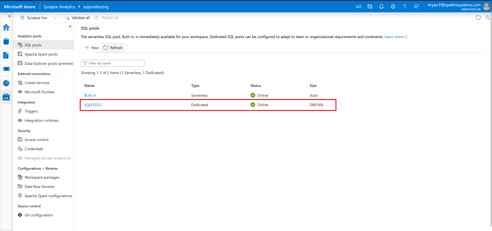

## Prerequisites

To complete this tutorial's steps, you need to have access to a resource group for which you are assigned the Owner role. Create the Synapse workspace in this resource group.

### Create a Synapse workspace in the Azure portal

#### Start the process

1. Open the Azure portal, in the search bar enter Synapse without hitting enter.

2. In the search results, under Services, select Azure Synapse Analytics.

3. Select Create to create a workspace.

#### Basics tab > Project Details

Fill in the following fields:

- **Subscription** - Pick any subscription.
- **Resource group** - Use any resource group.
- **Managed Resource group** - Leave this blank.

#### Basics tab > Workspace details

Fill in the following fields:

- **Workspace name** - Pick any globally unique name. In this tutorial, we'll use `myworkspace`.

- **Region** - Pick the region where you have placed your client applications/services (for example, Azure VM, Power BI, Azure Analysis Service) and storages that contain data (for example Azure Data Lake storage, Azure Cosmos DB analytical storage).

*Note: A workspace that is not co-located with the client applications or storage can be the root cause of many performance issues. If your data or the clients are placed in multiple regions, you can create separate workspaces in different regions co-located with your data and clients.*

#### Select Data Lake Storage Gen 2:

- By Account name, select Create New and name the new storage account . the name must be unique.

- By File system name, select Create New and name it `users`. This will create a storage container called `users`. The workspace will use this storage account as the "primary" storage account to Spark tables and Spark application logs.

- Check the "Assign myself the Storage Blob Data Contributor role on the Data Lake Storage Gen2 account" box.

## Completing the process

Select **Review + create** > **Create**. Your workspace is ready in a few minutes.

*Note: To enable workspace features from an existing dedicated SQL pool (formerly SQL DW) refer to How to enable a workspace for your dedicated SQL pool (formerly SQL DW).*

### Open Synapse Studio

After your Azure Synapse workspace is created, copy the link as shown in the picture and paste it in your browser's incognito mode.

Create a dedicated SQL pool

- In Synapse Studio, on the left-side pane, select Manage > SQL pools under Analytics pools.

- Select New.

- For Dedicated SQL pool name select SQLPOOL1.
- For Performance level choose DW100C.
- Select Review + create > Create. Your dedicated SQL pool will be ready in a few minutes.

Your dedicated SQL pool is associated with a SQL database that's also called SQLPOOL1.

- Navigate to Data > Workspace.
- You should see a database named SQLPOOL1. If you do not see it, select Refresh.

